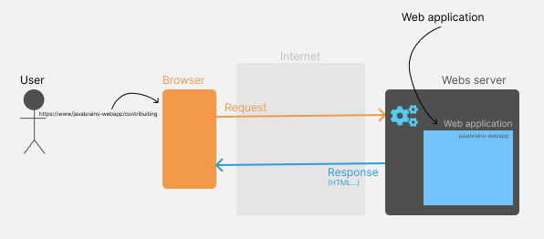

MY GOAL

After this bootcamp I want to improve my hands-on experience and to deeply understand what I do when building an application.

WEB APPLICATION

A web application is software that runs in your web browser.

APPLICATION ARCHITECTURE

The three-tier architecture is a software design pattern used in the web applications development.

It consists of 3 layers:
- presentation layer (user interface)
- application logic layer (business logic)
- the data layer (interface to the data stored in a database)

