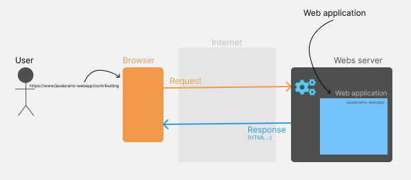

MY GOAL

After this bootcamp I want to improve my hands-on experience and to deeply understand what I do when building an application.

WEB APPLICATION

A web application is software that runs in your web browser.

APPLICATION ARCHITECTURE

The three-tier architecture is a software design pattern used in the web applications development.

It consists of 3 layers:
- Presentation layer (user interface - UI)
- Application logic layer (business logic)
- Data layer (interface to the data stored in a database)

FRONTEND VS BACKEND

Front end (client-side) is the portion of the application responsible for the UI and the way the user interacts with the application.

Back end (server-side) is the portion responsible for the behind-the-scenes functionality of the application (processing user input, querying databases, performing calculations, and generating responses).

REQUESTS FLOW

After the page loads on the browser, it makes a request to the CDN. Then, depending on the application complexity ("simple" application or a microservice) the JS makes calls or to a backend server (in a "simple" app) or to an API Gateway (in microservices).

In a "simple" app, the backend server can communicate to the database and return a response.

In microservices, the API Gateway routes the call to corresponding service, wich communicates with respective database and returns a response.